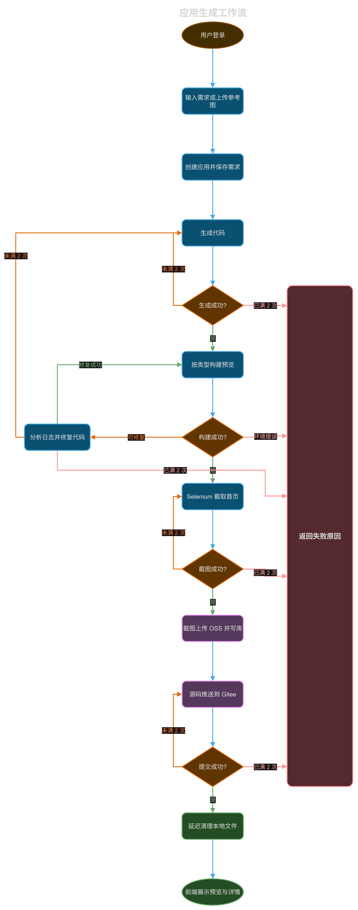

# Flashcode

面向编程初学者的一键应用生成平台。用户用自然语言描述想要的系统，平台生成需求文档和可运行代码，并可以发布成公开网址。目前支持三种应用：**HTML**、**Vue3**、**Vue3 + Spring**。

[Github](https://github.com/EmrysHhy/flashcode)

## 使用流程

1. 登录后发送提示词，模型返回需求文档。

   

   

2. 审核或修改需求文档，点击立即生成。系统写完代码后在当前页实时预览。

   

3. 普通编辑用元素选择器选中页面元素，再描述要改的内容。

   

4. 高级编辑打开 code-server，直接改 `user-code` 里的源码。

   

5. 发布后应用进入案例广场，也可以用网址直接访问。

   

完整链路是：需求对话 → 应用生成 → 构建预览 → 截图归档 → 代码托管 → 清理临时文件。

生成成功才进入构建。构建失败且代码可修时，模型根据构建日志修复后再构建；环境错误直接结束。截图和推送 Gitee 各自重试，生成、截图、提交在一次流程里最多各执行 2 次。

## 仓库结构

| 目录 | 内容 |
| --- | --- |
| `flashcode-fe` | Vue 3 门户。首页对话、应用预览、元素编辑、案例广场。 |
| `flashcode-be` | 后端。Gateway、Portal、File、Image MCP 和 Common。 |

Portal 负责生成、构建、截图和推送。File 负责 OSS。Image MCP 只提供 `search_images`。Gateway 统一鉴权并转发。

## 技术架构

| 分类 | 技术/组件 | 简介 |
| --- | --- | --- |
| AI相关 | Spring AI Alibaba | 接入通义千问。对话、向量和 Graph 工作流共用这一套，模型名配在 Nacos 的 `spring.ai.dashscope.chat.options.model`。 |
| AI相关 | 会话记忆 | 多轮上下文放在 Redis。生成出的整份源码不写入记忆，下一轮窗口留给需求和修改说明。 |
| AI相关 | 多模态 | `ChatClientConfig` 按模型名打开 `multiModel`。名字里带 `-vl` 或 `qwen3.8` 时走视觉接口，提示词里只放 `IMG_n` 记号。 |
| AI相关 | RAG | 生成和改需求时用 `QuestionAnswerAdvisor` 查 Milvus。 |
| AI相关 | MCP | `image-mcp` 单独提供 `search_images`。门户决定搜什么、用哪几张，图源失败不打断代码生成。 |
| AI相关 | Multi-Agent | `StateGraph` 串起生成、构建预览、修错、截图和提交。生成、截图、提交在一次流程里各最多执行 2 次。 |
| AI相关 | Milvus | 向量库，旁边跑 etcd 和 MinIO。向量由通义 embedding 写入，供 RAG 做相似度检索。 |
| 后端 | Spring Boot | 3.3.3，运行在 Java 21。门户、网关、文件服务、搜图服务各自打成一个可执行包。 |
| 后端 | Spring Cloud | Gateway 做统一入口，OpenFeign 调文件服务，LoadBalancer 按 Nacos 上的实例转发。 |
| 后端 | Redis | 存对话记忆和登录验证码。生成代码时的整份源码不写入记忆。 |
| 后端 | Nacos | 注册中心和配置中心，独立模式，配置数据在 MySQL。模型名、图搜开关、Gitee 令牌改配置即可，不用重新打包。 |
| 后端 | MySQL | 存用户、应用、需求文档和聊天记录。应用描述是短摘要，完整文档在 `app_doc`。 |
| 后端 | MyBatis-Plus | 门户的持久层，映射用户和应用相关表。 |
| 后端 | JWT | 登录后签发访问令牌，网关和门户用同一套校验。 |
| 后端 | Nginx | 预览容器托管用户应用的静态资源。`/{appId}/api` 的 location 按 appId 动态生成并热重载，反代到对应 jar。发布目录和预览 dist 分开。 |
| 后端 | 阿里云 OSS | 存截图、配图和用户头像，公开读。 |
| 后端 | Selenium | 容器里的 Chrome 打开预览地址截首页。ChromeDriver 在构建镜像时放进容器。 |
| 运维 | Docker | 中间件和应用都跑在容器里。门户通过 docker-java 执行用户工程的 `npm run build`，并按 appId 分配端口、在预览容器内启动后端 jar。 |
| 运维 | Docker Compose | 一次拉起 MySQL、Nacos、Redis、Milvus、预览 Nginx，以及 Prometheus、Grafana。 |
| 运维 | Prometheus | 每 15 秒抓取门户 Actuator 的 `/portal/actuator/prometheus`。生成耗时、token 用量和上下文占用率进入时序库。 |
| 运维 | Grafana | 读取 Prometheus 做监控面板，管理端口映射在 3001。 |
| 三方对接 | Gitee | 用户应用的文本源码推到 `flash-user-code/{appId}/`。本地目录删掉后可以再拉回来。图片不进这个仓库。 |
| 三方对接 | 阿里云短信 / 邮件 | 登录验证码。手机号走短信，邮箱走邮件，验证码和当日发送次数缓存在 Redis。 |
| 前端 | Vue 3 | 门户框架，Vite 构建。生成出的用户应用也以 Vue 3 为主。 |
| 前端 | Element Plus | 登录、列表和表单。 |

## 生成与预览

模型只能生成 `Html`、`Vue3`、`Spring_Vue3`。输出第一行是应用类型，随后每个文件按 `FILE: 相对路径` 加完整代码块给出。`AnalysisUtil` 按这个协议落盘，并拒绝跑出应用目录的路径。同一个 `appId` 重新生成前会清掉旧源码，避免留下多个启动类。

三种应用的构建方式不同：

- **Html**：把 `index.html` 复制到预览目录。
- **Vue3**：在工程目录执行 `npm install` 和 `npm run build`，再复制 `dist`。路由使用 hash，避免 Nginx 把前端路由当成物理文件。
- **Spring_Vue3**：先构建 `frontend`，再 `mvn clean package -DskipTests`。后端端口按 `8001 + appId % 1999` 分配。预览 Nginx 为 `/{appId}/api/` 写入 `proxy_pass`，然后 `nginx -s reload`。Controller 仍然映射 `/api`，appId 只出现在对外前缀上。

源码在 `user-code/{appId}`，预览产物在 `user-preview/{appId}`，发布产物再复制到部署目录。Portal 和 Preview 容器通过 Compose 共享这些目录。

参考图放在 `user-reference/{appId}`。配图由 `image-mcp` 搜索，提示词里只用 `IMG_n`，生成完成后再换成 OSS 地址。搜图或向量库不可用时，主流程继续，页面用色块或 SVG。

截图用无头 Chrome 打开预览地址，上传 OSS 后把地址写入应用表。源码确认推到 Gitee 之后，再延迟删除本地源码、参考图和截图。

## 登录与数据

手机号验证码、邮箱验证码和微信扫码登录后使用同一套身份。JWT 携带用户标识，Redis 保存登录用户和过期时间。网关先解析 JWT，再检查 Redis，因此退出登录后旧令牌不能继续访问。生成耗时长，令牌接近过期时会刷新 Redis 中的登录信息。

聊天记录写入 MySQL，最近消息放 Redis。模型上下文不保留完整 `FILE:` 源码，只保留「应用已更新」或短摘要。应用创建、类型、预览地址、截图地址和发布状态分步更新，不把模型调用、构建和浏览器操作包进同一个事务。

## 部署与约束

开发、测试、生产用不同的 Compose 和 Nacos 配置。MySQL 就绪后再启动 Nacos；Nacos、Milvus 冷启动较慢，健康检查需要足够的 `start_period`。Prometheus 记录每个 `appId` 最近一次生成耗时。关键日志带 `appId`、用户、工作流节点和构建阶段。

使用和修改时需要守住这些边界：

- 调整提示词后，要同时验证三类应用的目录结构和构建命令。
- 用户生成的代码按不可信输入处理。路径、后缀、文件大小、命令参数和容器权限都要限制。
- 长耗时节点要有超时、重试上限和资源释放。生成、截图、提交不要无限重试。
- 预览地址、截图地址、Gitee 目录和本地目录生命周期不同，不能用一个成功标志代替全部状态。
- JWT 密钥、OSS 密钥、数据库密码和第三方令牌放在 Nacos 或环境变量中，不写入前端、仓库和公开文档。
