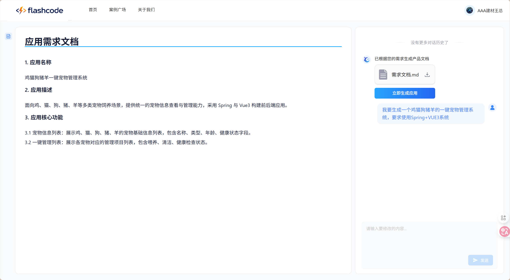
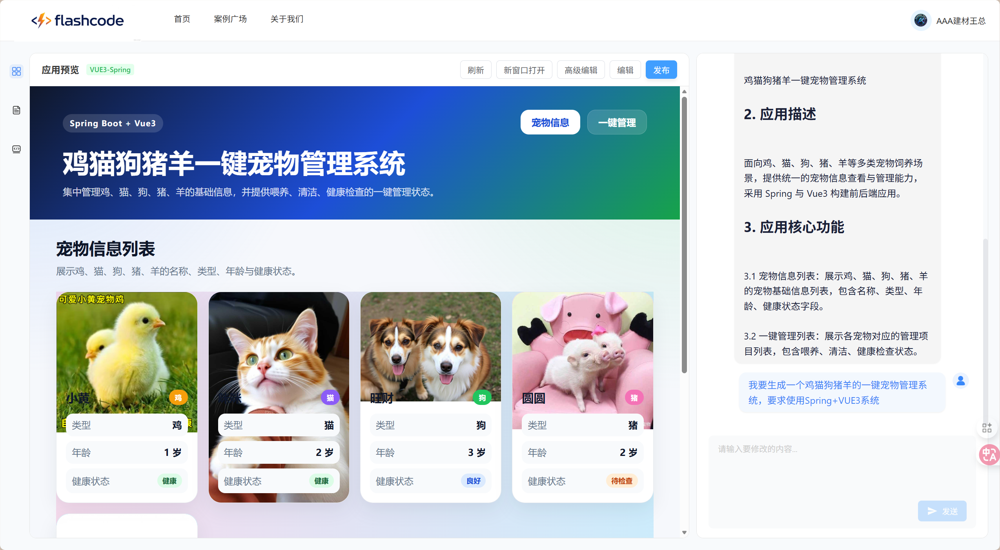
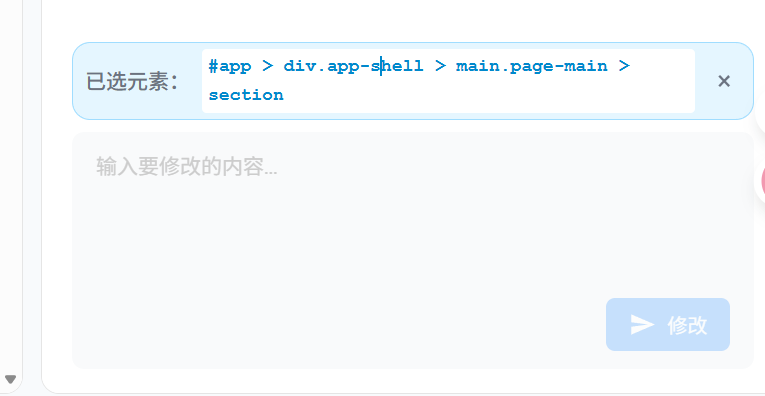
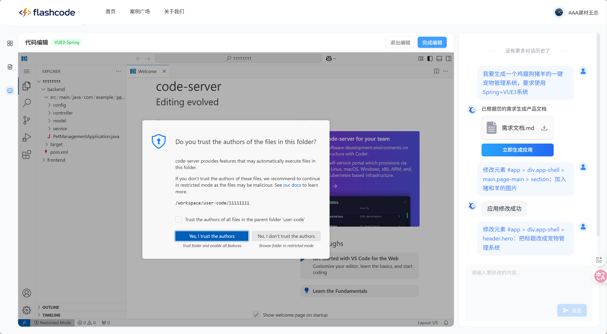
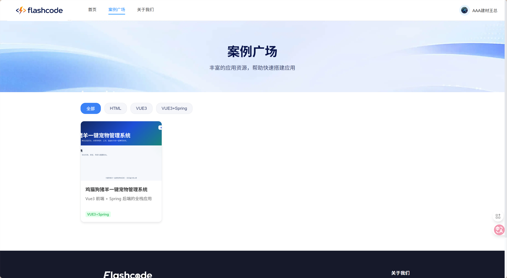
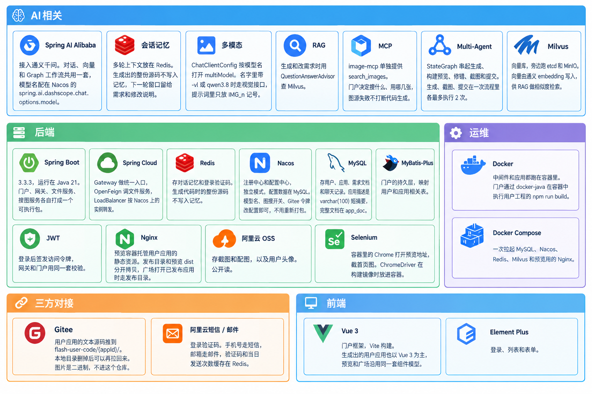

# 项目介绍
**Flashcode** 是一个面向编程小白的一键应用生成项目。可以通过自然语言一键生成自己想要的系统并且可选择发布网址提供给任何人使用。目前支持的编程语言有：**HTML**、**VUE3** 和 **VUE3+Spring**。
***
## 大致流程
   1.  用户登录后发送提示词，模型返回需求文档。
        
        
   2.  审核或修改大模型返回的需求文档，点击立即生成即可等待系统生成好代码并且能够在本页面中实时预览
        
   3.  用户可通过普通编辑模式通过元素选择器选择元素修改内容
      
   4. 高级编辑功能提供VsCode页面可以手动修改代码
        
   5. 点击发布之后就可以公开此应用到大厅中，所有用户都可以点击访问,也可以直接在浏览器通过网址访问
        
# 项目组件

| 分类 | 技术/组件 | 简介 |
| --- | --- | --- |
| AI相关 | Spring AI Alibaba | 接入通义千问。对话、向量和 Graph 工作流共用这一套，模型名配在 Nacos 的 `spring.ai.dashscope.chat.options.model`。 |
| AI相关 | 会话记忆 | 多轮上下文放在 Redis。生成出的整份源码不写入记忆，下一轮窗口留给需求和修改说明。 |
| AI相关 | 多模态 | `ChatClientConfig` 按模型名打开 `multiModel`。名字里带 `-vl` 或 `qwen3.8` 时走视觉接口，提示词里只放 `IMG_n` 记号。 |
| AI相关 | RAG | 生成和改需求时用 `QuestionAnswerAdvisor` 查 Milvus。 |
| AI相关 | MCP | `image-mcp` 单独提供 `search_images`。门户决定搜什么、用哪几张，图源失败不打断代码生成。 |
| AI相关 | Multi-Agent | `StateGraph` 串起生成、构建预览、修错、截图和提交。生成、截图、提交在一次流程里各最多执行 2 次。 |
| AI相关 | Milvus | 向量库，旁边跑 etcd 和 MinIO。向量由通义 embedding 写入，供 RAG 做相似度检索。 |
| 后端 | Spring Boot | 3.3.3，运行在 Java 21。门户、网关、文件服务、搜图服务各自打成一个可执行包。 |
| 后端 | Spring Cloud | Gateway 做统一入口，OpenFeign 调文件服务，LoadBalancer 按 Nacos 上的实例转发。 |
| 后端 | Redis | 存对话记忆和登录验证码。生成代码时的整份源码不写入记忆。 |
| 后端 | Nacos | 注册中心和配置中心，独立模式，配置数据在 MySQL。模型名、图搜开关、Gitee 令牌改配置即可，不用重新打包。 |
| 后端 | MySQL | 存用户、应用、需求文档和聊天记录。应用描述是 `varchar(100)` 短摘要，完整文档在 `app_doc`。 |
| 后端 | MyBatis-Plus | 门户的持久层，映射用户和应用相关表。 |
| 后端 | JWT | 登录后签发访问令牌，网关和门户用同一套校验。 |
| 后端 | Nginx | 预览容器托管用户应用的静态资源；`/{appId}/api` 的 location 由脚本按 appId 动态生成并热重载，反向代理到对应 jar 的端口。发布目录和预览 dist 分开拷贝，广场打开已发布应用时走发布目录。 |
| 后端 | 阿里云 OSS | 存截图和配图，以及用户头像。公开读。|
| 后端 | Selenium | 容器里的 Chrome 打开预览地址，截首页图。ChromeDriver 在构建镜像时放进容器。 |
| 运维 | Docker | 中间件和应用都跑在容器里。门户通过 docker-java 在容器中执行用户工程的 `npm run build`，并按 appId 分配端口、在预览容器内启动后端 jar。 |
| 运维 | Docker Compose | 一次拉起 MySQL、Nacos、Redis、Milvus、预览 Nginx，以及 Prometheus、Grafana。 |
| 运维 | Prometheus | 每 15 秒抓取门户 Actuator 的 `/portal/actuator/prometheus`。生成耗时、token 用量和上下文占用率都从这里进时序库。 |
| 运维 | Grafana | 读 Prometheus 的数据做监控面板。管理端口映射在 3001。 |
| 三方对接 | Gitee | 用户应用的文本源码推到 `flash-user-code/{appId}/`。本地目录删掉后可以再拉回来。图片是二进制，不进这个仓库。 |
| 三方对接 | 阿里云短信 / 邮件 | 登录验证码。手机号走短信，邮箱走邮件，验证码和当日发送次数缓存在 Redis。 |
| 前端 | Vue 3 | 门户框架，Vite 构建。生成出的用户应用也以 Vue 3 为主，预览和广场沿用同一套组件模型。 |
| 前端 | Element Plus | 登录、列表和表单。 |

[Github](https://github.com/EmrysHhy/flashcode)

